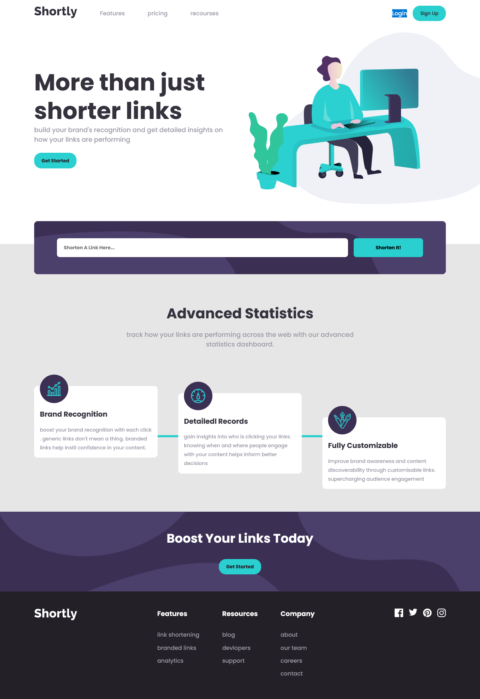
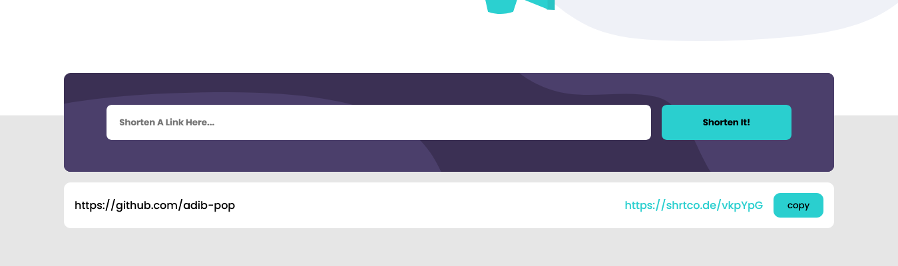
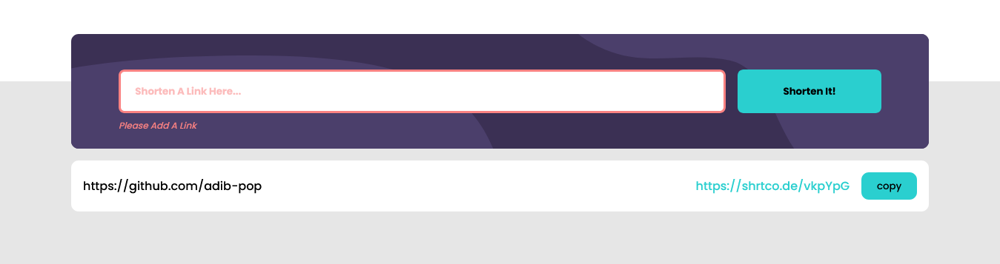

# Shortly URL shortening API 

in this project I will be creating a URL shortening API landing page, integrating with the [shrtco.de/docs](https://shrtco.de/docs) API. The challenge is to build out this landing page, integrate with the [shrtco.de/docs](https://shrtco.de/docs) API and get it looking as close to the design as possible. 

## screenshot





### The challenge

Users should be able to:

- View the optimal layout for the site depending on their device's screen size
- Shorten any valid URL
- See a list of their shortened links, even after refreshing the browser
- Copy the shortened link to their clipboard in a single click
- Receive an error message when the `form` is submitted if:
  - The `input` field is empty

### Built with

- Semantic HTML5 markup
- CSS 
- [axios](https://axios-http.com/docs/intro) - JS library
- api [shrtco.de/docs](https://shrtco.de/docs) - API

### Useful resources to work on this project

- [axios](https://axios-http.com/docs/intro) - This helped me to make the request to the API.

#### install axios

```bash
npm install axios
```

#### import axios

```js
import axios from 'axios';
```
